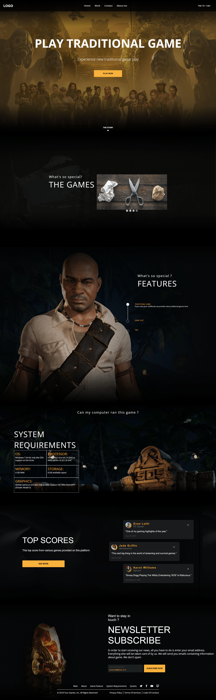

# Landing Page Traditional Game

My task is to build out this Web Landing Page Traditional Game and get it looking as close to the design as possible.

Notes:

- Build with HTML, CSS and JavaScript
- Create responsive design for desktop and mobile
- Push and deploy your project

Figma design for web

## Stack

Stack yang digunakan didalam tugas ini

* Front-end - HTML, CSS, Javascript

## Deployment

For this assigment, deployment web at Netlify :

[Netlify](@https://app.netlify.com/)

[Deploy Website](https://assignment1-landing-page.netlify.app/)